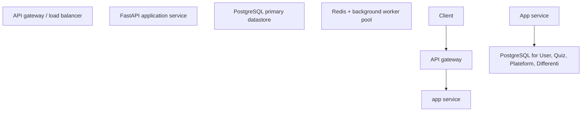
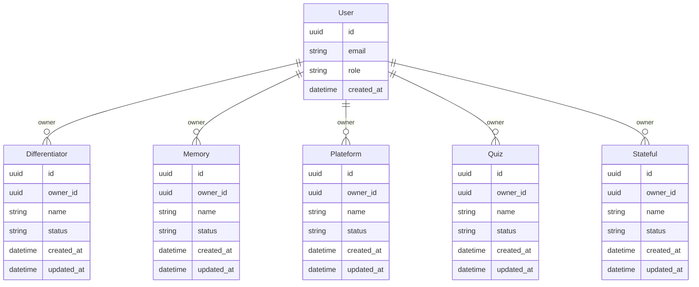

# AI Quiz Plateform

  

> Generated by **Autonomous Product Studio** — idea → research → architecture → a runnable scaffold.

## Overview

MVP includes: Would be great if; Differentiator: Mem0 adds a stateful memory; Differentiator: This enables. Deferred to fast-follow: none. Goal: smallest releasable slice that resolves the highest-severity pain.

## Features

- **Would be great if** `[Should]` — Addresses the user pain: 'It would be great if there were an option to turn off the time limit for both the questions'.
- **Differentiator: Mem0 adds a stateful memory** `[Could]` — Capability seen in the competitive set (1×); candidate parity/differentiator feature.
- **Differentiator: This enables** `[Could]` — Capability seen in the competitive set (1×); candidate parity/differentiator feature.

## Architecture



## Data Model



## Tech Stack

- Backend: FastAPI (async Python) — fast to build, typed, great for AI tool I/O
- DB: PostgreSQL — relational integrity for the core entities
- Frontend: React + Vite — matches the existing frontend (ADR-0007)
- Hosting: containerized (Docker) on a managed platform — simple ops at MVP
- Async: Redis + a worker queue — offload long/batch jobs
- Cache: Redis — cut read latency on hot paths

## Project Structure

```
├── .env.example
├── .github
│   └── workflows
│       └── ci.yml
├── .gitignore
├── CONTRIBUTING.md
├── LICENSE
├── README.md
├── backend
│   ├── Dockerfile
│   ├── app
│   │   ├── __init__.py
│   │   ├── api
│   │   │   ├── __init__.py
│   │   │   └── routes.py
│   │   ├── config.py
│   │   ├── main.py
│   │   └── models
│   │       ├── __init__.py
│   │       └── schema.py
│   ├── requirements.txt
│   └── tests
│       └── test_smoke.py
├── docs
│   ├── API.md
│   ├── ARCHITECTURE.md
│   ├── ROADMAP.md
│   └── openapi.json
├── frontend
│   ├── README.md
│   └── package.json
└── infra
    └── docker-compose.yml
```

## Quick Start

```bash
# 1) backend
cd backend && python -m venv .venv && source .venv/bin/activate
pip install -r requirements.txt
uvicorn app.main:app --reload      # → http://localhost:8000/docs
```

Or run the whole stack with Docker:

```bash
docker compose -f infra/docker-compose.yml up --build
```

## Roadmap

See [`docs/ROADMAP.md`](docs/ROADMAP.md). Architecture details in [`docs/ARCHITECTURE.md`](docs/ARCHITECTURE.md); API in [`docs/API.md`](docs/API.md).

---
*Scaffolded by APS. Each file has `TODO:` markers — implement them to ship.*
