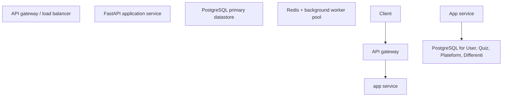
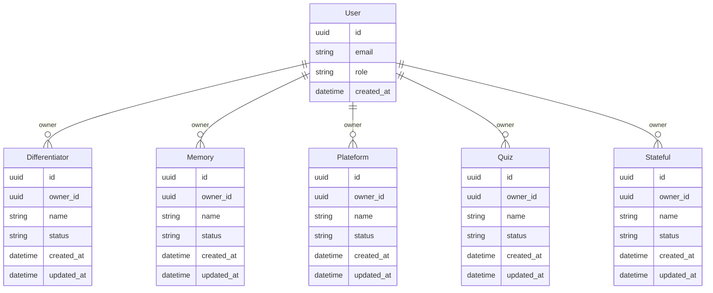

# Architecture — AI Quiz Plateform

> Generated by Autonomous Product Studio (APS) - fill in the TODOs to ship.

## System Architecture

## Data Model (ER)

## Scale & Non-Functional

Target scale: 10k–100k users (early B2B SaaS); ~50–200 RPS peak; p95 < 300ms reads. 3 features, 1 persona(s) drive a single-region deployment at MVP, horizontally scalable behind a load balancer.
